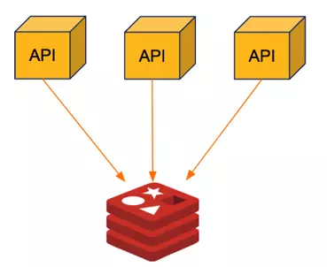
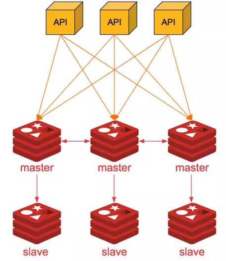

[Back to home](../../README.md)

# Phần 5: Các mô hình Redis (Redis Replication/ Cluster / HA), Ưu và nhược điểm

## 1 . Mô hình đơn:

- Ưu điểm: 
Tiết kiệm chi phí, phù hợp với môi trường nhỏ. Hiệu suất cao

- Nhược điểm: 
Không có tính dự phòng, nếu sập thì phải dựng lại từ đầu (nếu có backup dump.rdb thì thời gian load lại dữ liệu vài phút. VD: HDD, 50tr key tầm 2-5 phút). 
Có thể đưa lên k8s quản lý cho tiện. Nếu data chấp nhận tổn thất và code load lại từ Database thì sẽ gần như zero downtime (2-30s).

### Phân biệt giữa Replication và Cluster:

Phân biệt:
1) Replication: 1master-1slave hoặc 1master-nhiều-Slave (mỗi node sẽ chứa đủ 100% dữ liệu). 
2) Sharding cluster: Partition data (data được chia lẻ và lưu trên nhiều node khác nhau, tổng dữ liệu riêng rẽ các node = 100%). 

>> Khi nào ta nên chọn giữa replication / cluster sharding?:
- Về cơ bản, mô hình (1Master)- (1Slave) là đủ hoàn toàn để redis chạy hết hiệu năng cho cả 1 hệ thống lớn hàng trăm nghìn truy vấn trên 1s (bank/viễn thông...). 
- Vấn đề nằm ở chỗ khi lượng Ram cần dùng để lưu trữ Data của redis > vượt quá Ram của Server đang chạy. Khi đó ta sẽ bắt đầu chia nhỏ dữ liệu ra để lưu ở "nhiều server" khác nhau. Khi client gọi vào, redis-cluster sẽ hướng dẫn truy xuất vào chính xác node nào có dữ liệu.

## 2. Mô hình Master-Slave hoặc 1 Master và nhiều SLAVE

Ưu điểm: 
- Mô hình 1Master-1Slave hoặc 1Master-(N)Slave sẽ đảm bảo dữ liệu luôn luôn được dự phòng. 
- Khi xảy ra sự cố với node Master, ta sẽ manual Slave node thay làm Master.
- Có thể cho node M làm write, và các node S làm read, tăng khả năng chia tải.

Nhược điểm: 
- Khi Master chết, phải cấu hình thủ công Slave lên làm Master. Và phải tự động chuyển luồng cho client gọi vào M mới.
- Tối ưu hơn, ta có thể có mô hình Setinel tự động detect Master down và đẩy Slave node khác lên làm Master ở mục C.
- Vẫn sẽ có độ trễ về đồng bộ thông tin từ M > S. Ví dụ ta HMSET hàng triệu key có độ dài lớn vào M.

## 3. Mô hình SETINEL

Ưu điểm:
- Mô hình Setinel đã tối ưu ở việc "bầu chọn" đâu sẽ là Master node khi có node bị chết
- Nhưng app không biết đâu là Master mới để gọi vào khi Master bị thay đổi. 
Để khắc phục vấn đề này, các siêu nhân khác đã đưa ra phương án dùng HA-Proxy để phát hiện và lái luồng TCP về redis master. 
Hoặc dùng thư viện client sẵn có (như java jedis) có thể tự detect được đâu là M trong khối Setinel (không cần cài HAProxy)

Nhược điểm:
- Cần nhiều tài nguyên (cần ít nhất là 3 node để tránh bị tình trạng bầu chọn không đồng đều, các slave-setinel tự nhận mình là master - hiện tượng Split-Brain)

## 4. Mô hình SHARDING CLUSTER

Ưu điểm:
- Khắc phục được yếu điểm các mô hình trên là băm nhỏ dữ liệu sang các node.
- Đảm bảo downtime gần như zero. Dữ liệu luôn được đảm bảo 100% (gồm 3 node chính và 3 node phụ)
- Dễ dàng  mở rộng, chỉ cần gõ lệnh chia dữ liệu sang các node mới

Nhược Điểm:
- Cấu hình phức tạp, cần code client phải hỗ trợ cluster.
- Chỉ chạy trên db0 (không hỗ trợ multi db)

[Back to home](../../README.md)